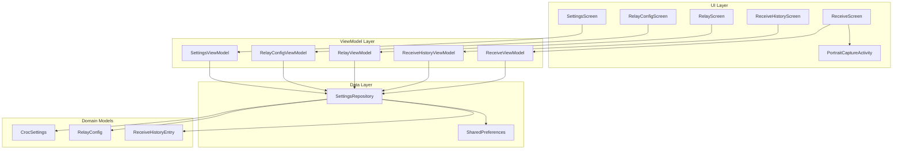
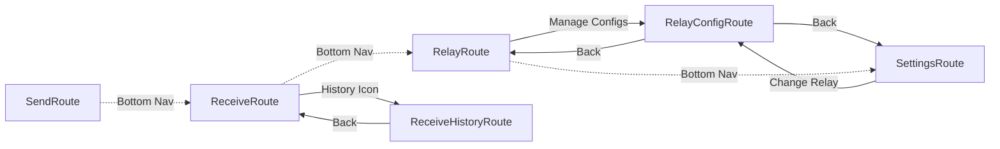

# Design Document: CrocDroid UI Improvements

## Overview

This design document specifies the technical implementation for three UI improvements to the CrocDroid Android application:

1. **QR Scanner Portrait Orientation**: Force portrait mode for the QR scanner using a custom `PortraitCaptureActivity`
2. **Receive History Screen**: Move inline receive history to a dedicated screen with navigation
3. **Relay Config Management**: Full CRUD system for managing relay server configurations

These improvements enhance usability by providing a consistent scanning experience, decluttering the receive interface, and enabling users to manage multiple relay server profiles.

### Technology Stack

- **Language**: Kotlin
- **UI Framework**: Jetpack Compose
- **Navigation**: Compose Navigation with type-safe routes
- **State Management**: ViewModel + StateFlow
- **Persistence**: SharedPreferences with kotlinx.serialization (JSON)
- **QR Scanning**: zxing-android-embedded 4.3.0

## Architecture

### High-Level Component Diagram



### Navigation Flow



### Component Responsibilities

#### UI Layer
- **ReceiveScreen**: Transfer code input, QR scanning, transfer state display, history navigation button
- **ReceiveHistoryScreen**: Full-page receive history with CRUD operations
- **RelayScreen**: Local relay server management with config selection
- **RelayConfigScreen**: Relay configuration CRUD interface
- **SettingsScreen**: Application settings with relay config display
- **PortraitCaptureActivity**: Custom QR scanner activity forcing portrait orientation

#### ViewModel Layer
- **ReceiveViewModel**: Manages file receiving operations and transfer state
- **ReceiveHistoryViewModel**: Manages receive history display and operations
- **RelayViewModel**: Manages local relay server and config selection
- **RelayConfigViewModel**: Manages relay configuration CRUD operations
- **SettingsViewModel**: Manages application settings

#### Data Layer
- **SettingsRepository**: Central persistence layer for settings, relay configs, and history

## Components and Interfaces

### 1. QR Scanner Portrait Orientation

#### PortraitCaptureActivity

**Purpose**: Custom activity extending zxing's `CaptureActivity` to enforce portrait orientation.

**Implementation**:
```kotlin
package com.henkenlink.crocdroid.ui.receive

import com.journeyapps.barcodescanner.CaptureActivity

class PortraitCaptureActivity : CaptureActivity()
```

**AndroidManifest.xml Declaration**:
```xml
<activity
    android:name=".ui.receive.PortraitCaptureActivity"
    android:screenOrientation="portrait"
    android:stateNotLostOnOrientationChange="true"
    android:theme="@style/zxing_CaptureTheme" />
```

**Integration in ReceiveScreen**:
```kotlin
val scanLauncher = rememberLauncherForActivityResult(
    contract = ScanContract(),
) { result ->
    result.contents?.let { scannedCode ->
        val sanitized = scannedCode.trim().replace(" ", "-")
        viewModel.updateReceiveCode(sanitized)
    }
}

// Usage
val options = ScanOptions().apply {
    setDesiredBarcodeFormats(ScanOptions.QR_CODE)
    setPrompt("Scan a croc transfer QR code")
    setBeepEnabled(false)
    setBarcodeImageEnabled(true)
    setOrientationLocked(true)
    setCaptureActivity(PortraitCaptureActivity::class.java) // NEW
}
scanLauncher.launch(options)
```

### 2. Receive History Screen

#### Navigation Routes

**File**: `navigation/CrocDroidNavHost.kt`

```kotlin
@Serializable
data object ReceiveHistoryRoute
```

#### ReceiveHistoryScreen

**Purpose**: Dedicated full-page screen for viewing and managing receive history.

**Composable Signature**:
```kotlin
@Composable
fun ReceiveHistoryScreen(
    viewModel: ReceiveHistoryViewModel,
    onNavigateBack: () -> Unit,
    modifier: Modifier = Modifier
)
```

**UI Structure**:
- TopAppBar with back button and "Clear All" action
- Empty state when no history (icon + message)
- LazyColumn of history entry cards
- Each card shows: filename, date, size, file count, actions (open, share, delete)
- Missing files show error state with delete-only action

#### ReceiveHistoryViewModel

**Purpose**: Manages receive history state and operations.

**Interface**:
```kotlin
class ReceiveHistoryViewModel(
    private val settingsRepository: SettingsRepository,
    private val context: Context
) : ViewModel() {
    
    val receiveHistoryState: StateFlow<List<ReceiveHistoryEntry>> = 
        settingsRepository.receiveHistoryState
    
    fun deleteHistoryEntry(id: String)
    fun clearHistory()
    fun openHistoryFile(filePath: String)
    fun shareHistoryFile(filePath: String)
    
    companion object {
        fun provideFactory(
            settingsRepository: SettingsRepository,
            context: Context
        ): ViewModelProvider.Factory
    }
}
```

**Operations**:
- `deleteHistoryEntry`: Calls `settingsRepository.removeReceiveHistoryEntry(id)`
- `clearHistory`: Calls `settingsRepository.clearReceiveHistory()`
- `openHistoryFile`: Creates ACTION_VIEW intent for file
- `shareHistoryFile`: Creates ACTION_SEND intent for file

#### ReceiveScreen Modifications

**Changes**:
1. Add `onNavigateToHistory: () -> Unit` parameter
2. Remove inline history section (lines 176-267)
3. Add history icon button in idle state:

```kotlin
// In idle state, after input card
Row(
    modifier = Modifier.fillMaxWidth(),
    horizontalArrangement = Arrangement.End
) {
    IconButton(onClick = onNavigateToHistory) {
        Icon(Icons.Default.History, contentDescription = "View History")
    }
}
```

### 3. Relay Config Management

#### RelayConfig Data Model

**File**: `domain/model/RelayConfig.kt`

```kotlin
@Serializable
data class RelayConfig(
    val id: String = UUID.randomUUID().toString(),
    val name: String,
    val relayAddress: String,
    val relayPorts: String,
    val relayPassword: String
) {
    companion object {
        val DEFAULT = RelayConfig(
            id = "default",
            name = "Default (croc)",
            relayAddress = "croc.schollz.com",
            relayPorts = "9009,9010,9011,9012,9013",
            relayPassword = "pass123"
        )
    }
}
```

#### CrocSettings Updates

**File**: `domain/model/CrocSettings.kt`

**New Field**:
```kotlin
@Serializable
data class CrocSettings(
    // ... existing fields ...
    val selectedRelayConfigId: String = "default"
)
```

**Behavior**: When a relay config is selected, `relayAddress`, `relayPorts`, and `relayPassword` are populated from the selected `RelayConfig`.

#### SettingsRepository Extensions

**New State**:
```kotlin
private val _relayConfigsState = MutableStateFlow(loadRelayConfigs())
val relayConfigsState: StateFlow<List<RelayConfig>> = _relayConfigsState.asStateFlow()
```

**CRUD Operations**:
```kotlin
private fun loadRelayConfigs(): List<RelayConfig> {
    val jsonString = prefs.getString("relay_configs_json", null)
    val configs = if (jsonString != null) {
        try {
            Json.decodeFromString<List<RelayConfig>>(jsonString)
        } catch (e: Exception) {
            emptyList()
        }
    } else {
        emptyList()
    }
    
    // Ensure default config is always present
    return if (configs.none { it.id == "default" }) {
        listOf(RelayConfig.DEFAULT) + configs
    } else {
        configs
    }
}

fun addRelayConfig(config: RelayConfig) {
    val currentConfigs = _relayConfigsState.value.toMutableList()
    currentConfigs.add(config)
    saveRelayConfigs(currentConfigs)
}

fun updateRelayConfig(config: RelayConfig) {
    val currentConfigs = _relayConfigsState.value.toMutableList()
    val index = currentConfigs.indexOfFirst { it.id == config.id }
    if (index != -1) {
        currentConfigs[index] = config
        saveRelayConfigs(currentConfigs)
    }
}

fun removeRelayConfig(id: String) {
    // Prevent deletion of default config
    if (id == "default") return
    
    val updatedConfigs = _relayConfigsState.value.filter { it.id != id }
    saveRelayConfigs(updatedConfigs)
}

fun selectRelayConfig(configId: String) {
    val config = _relayConfigsState.value.find { it.id == configId } ?: return
    val currentSettings = _settingsState.value
    
    updateSettings(currentSettings.copy(
        selectedRelayConfigId = configId,
        relayAddress = config.relayAddress,
        relayPorts = config.relayPorts,
        relayPassword = config.relayPassword
    ))
}

private fun saveRelayConfigs(configs: List<RelayConfig>) {
    val jsonString = Json.encodeToString(configs)
    prefs.edit {
        putString("relay_configs_json", jsonString)
    }
    _relayConfigsState.value = configs
}
```

#### RelayConfigScreen

**Purpose**: Full-page CRUD interface for relay configurations.

**Composable Signature**:
```kotlin
@Composable
fun RelayConfigScreen(
    viewModel: RelayConfigViewModel,
    onNavigateBack: () -> Unit,
    modifier: Modifier = Modifier
)
```

**UI Structure**:
- TopAppBar with "Relay Configs" title and back button
- LazyColumn of relay config cards
- Each card shows: name, address, ports, password (masked)
- Edit button for all configs
- Delete button for non-default configs
- FAB for adding new config
- Dialog for add/edit operations

**Dialog Fields**:
- Name (TextField)
- Relay Address (TextField)
- Relay Ports (TextField, placeholder: "9009,9010,9011")
- Relay Password (TextField)

#### RelayConfigViewModel

**Purpose**: Manages relay configuration CRUD operations.

**Interface**:
```kotlin
class RelayConfigViewModel(
    private val settingsRepository: SettingsRepository
) : ViewModel() {
    
    val relayConfigsState: StateFlow<List<RelayConfig>> = 
        settingsRepository.relayConfigsState
    
    fun addConfig(name: String, address: String, ports: String, password: String)
    fun updateConfig(id: String, name: String, address: String, ports: String, password: String)
    fun deleteConfig(id: String)
    
    companion object {
        fun provideFactory(
            settingsRepository: SettingsRepository
        ): ViewModelProvider.Factory
    }
}
```

**Implementation**:
```kotlin
fun addConfig(name: String, address: String, ports: String, password: String) {
    val config = RelayConfig(
        name = name,
        relayAddress = address,
        relayPorts = ports,
        relayPassword = password
    )
    settingsRepository.addRelayConfig(config)
}

fun updateConfig(id: String, name: String, address: String, ports: String, password: String) {
    val config = RelayConfig(
        id = id,
        name = name,
        relayAddress = address,
        relayPorts = ports,
        relayPassword = password
    )
    settingsRepository.updateRelayConfig(config)
}

fun deleteConfig(id: String) {
    settingsRepository.removeRelayConfig(id)
}
```

#### RelayScreen Modifications

**New UI Elements**:
1. Relay config selector dropdown showing current config name
2. "Manage Configs" button navigating to RelayConfigRoute
3. Auto-fill host/port/password from selected config

**Updated Composable Signature**:
```kotlin
@Composable
fun RelayScreen(
    viewModel: RelayViewModel,
    onNavigateToRelayConfig: () -> Unit,
    modifier: Modifier = Modifier
)
```

**New UI Section** (before existing host/port/password fields):
```kotlin
Card(
    colors = CardDefaults.cardColors(containerColor = MaterialTheme.colorScheme.surfaceVariant),
    modifier = Modifier.fillMaxWidth()
) {
    Column(modifier = Modifier.padding(16.dp)) {
        Text("Relay Configuration", style = MaterialTheme.typography.titleMedium)
        Spacer(modifier = Modifier.height(8.dp))
        
        Row(
            modifier = Modifier.fillMaxWidth(),
            horizontalArrangement = Arrangement.SpaceBetween,
            verticalAlignment = Alignment.CenterVertically
        ) {
            Text(selectedConfig?.name ?: "None", style = MaterialTheme.typography.bodyLarge)
            IconButton(onClick = onNavigateToRelayConfig) {
                Icon(Icons.Default.Settings, contentDescription = "Manage Configs")
            }
        }
        
        // Dropdown for selecting config
        var expanded by remember { mutableStateOf(false) }
        ExposedDropdownMenuBox(
            expanded = expanded,
            onExpandedChange = { expanded = it }
        ) {
            OutlinedTextField(
                value = selectedConfig?.name ?: "Select Config",
                onValueChange = {},
                readOnly = true,
                trailingIcon = { ExposedDropdownMenuDefaults.TrailingIcon(expanded = expanded) },
                modifier = Modifier.fillMaxWidth().menuAnchor()
            )
            ExposedDropdownMenu(
                expanded = expanded,
                onDismissRequest = { expanded = false }
            ) {
                relayConfigs.forEach { config ->
                    DropdownMenuItem(
                        text = { Text(config.name) },
                        onClick = {
                            viewModel.selectRelayConfig(config.id)
                            expanded = false
                        }
                    )
                }
            }
        }
    }
}
```

#### RelayViewModel Updates

**New Dependencies**:
```kotlin
class RelayViewModel(
    private val crocEngine: CrocEngine,
    private val settingsRepository: SettingsRepository // NEW
) : ViewModel()
```

**New State**:
```kotlin
val relayConfigsState: StateFlow<List<RelayConfig>> = 
    settingsRepository.relayConfigsState

val selectedRelayConfig: StateFlow<RelayConfig?> = 
    settingsRepository.settingsState.map { settings ->
        settingsRepository.relayConfigsState.value.find { 
            it.id == settings.selectedRelayConfigId 
        }
    }.stateIn(viewModelScope, SharingStarted.WhileSubscribed(5000), null)
```

**New Method**:
```kotlin
fun selectRelayConfig(configId: String) {
    settingsRepository.selectRelayConfig(configId)
}
```

#### SettingsScreen Modifications

**Relay Section Changes**:
Replace editable relay address/ports/password fields with:

```kotlin
SettingsCard(title = "Relay & Connection", icon = Icons.Default.Router) {
    // Read-only display of selected config
    OutlinedTextField(
        value = selectedConfig?.name ?: "None",
        onValueChange = {},
        readOnly = true,
        label = { Text("Active Relay Configuration") },
        modifier = Modifier.fillMaxWidth(),
        trailingIcon = {
            IconButton(onClick = onNavigateToRelayConfig) {
                Icon(Icons.Default.Edit, contentDescription = "Change")
            }
        }
    )
    
    Spacer(Modifier.height(16.dp))
    HorizontalDivider()
    Spacer(Modifier.height(16.dp))
    
    // Keep Peer IP field as-is
    OutlinedTextField(
        value = settings.peerIp,
        onValueChange = { viewModel.updateSettings(settings.copy(peerIp = it)) },
        label = { Text("Peer IP (Direct Connect)") },
        placeholder = { Text("e.g. 192.168.1.10:9009") },
        modifier = Modifier.fillMaxWidth(),
    )
    Text(
        text = "Bypass relay and securely connect directly to an IP address.",
        style = MaterialTheme.typography.bodySmall,
        color = MaterialTheme.colorScheme.onSurfaceVariant,
        modifier = Modifier.padding(top = 4.dp, start = 4.dp)
    )
}
```

**Updated Signature**:
```kotlin
@Composable
fun SettingsScreen(
    viewModel: SettingsViewModel,
    onNavigateToLogs: () -> Unit,
    onNavigateToRelayConfig: () -> Unit, // NEW
    modifier: Modifier = Modifier,
)
```

#### MainActivity Navigation Integration

**New Routes**:
```kotlin
composable<ReceiveHistoryRoute> {
    val viewModel: ReceiveHistoryViewModel = viewModel(
        factory = ReceiveHistoryViewModel.provideFactory(settingsRepository, LocalContext.current)
    )
    ReceiveHistoryScreen(
        viewModel = viewModel,
        onNavigateBack = { navController.popBackStack() }
    )
}

composable<RelayConfigRoute> {
    val viewModel: RelayConfigViewModel = viewModel(
        factory = RelayConfigViewModel.provideFactory(settingsRepository)
    )
    RelayConfigScreen(
        viewModel = viewModel,
        onNavigateBack = { navController.popBackStack() }
    )
}
```

**Updated Existing Routes**:
```kotlin
composable<ReceiveRoute> {
    val viewModel: ReceiveViewModel = viewModel(
        factory = ReceiveViewModel.provideFactory(crocEngine, settingsRepository, LocalContext.current)
    )
    ReceiveScreen(
        viewModel = viewModel,
        onNavigateToHistory = { navController.navigate(ReceiveHistoryRoute) } // NEW
    )
}

composable<RelayRoute> {
    val viewModel: RelayViewModel = viewModel(
        factory = RelayViewModel.provideFactory(crocEngine, settingsRepository) // UPDATED
    )
    RelayScreen(
        viewModel = viewModel,
        onNavigateToRelayConfig = { navController.navigate(RelayConfigRoute) } // NEW
    )
}

composable<SettingsRoute> {
    val viewModel: SettingsViewModel = viewModel(
        factory = SettingsViewModel.provideFactory(settingsRepository, LocalContext.current)
    )
    SettingsScreen(
        viewModel = viewModel,
        onNavigateToLogs = { navController.navigate(DebugLogRoute) },
        onNavigateToRelayConfig = { navController.navigate(RelayConfigRoute) } // NEW
    )
}
```

**Bottom Bar Visibility**:
```kotlin
val showBottomBar = currentDestination?.route?.let { route ->
    route.contains("DebugLogRoute") == false &&
    route.contains("ReceiveHistoryRoute") == false &&
    route.contains("RelayConfigRoute") == false
} ?: true
```

## Data Models

### RelayConfig

```kotlin
@Serializable
data class RelayConfig(
    val id: String = UUID.randomUUID().toString(),
    val name: String,
    val relayAddress: String,
    val relayPorts: String,
    val relayPassword: String
)
```

**Fields**:
- `id`: Unique identifier (UUID, default config uses "default")
- `name`: Display name (e.g., "Default (croc)", "Work Server")
- `relayAddress`: Server address (e.g., "croc.schollz.com")
- `relayPorts`: Comma-separated port list (e.g., "9009,9010,9011,9012,9013")
- `relayPassword`: Relay authentication password

**Default Instance**:
```kotlin
RelayConfig(
    id = "default",
    name = "Default (croc)",
    relayAddress = "croc.schollz.com",
    relayPorts = "9009,9010,9011,9012,9013",
    relayPassword = "pass123"
)
```

### CrocSettings Updates

**New Field**:
```kotlin
val selectedRelayConfigId: String = "default"
```

**Behavior**: 
- When `selectedRelayConfigId` changes, `relayAddress`, `relayPorts`, and `relayPassword` are updated from the corresponding `RelayConfig`
- This ensures consistency between selected config and active settings

### ReceiveHistoryEntry

**Existing Model** (no changes):
```kotlin
@Serializable
data class ReceiveHistoryEntry(
    val id: String,
    val fileName: String,
    val fileSize: Long,
    val fileCount: Int,
    val filePaths: List<String>,
    val timestamp: Long
)
```

## Correctness Properties

*A property is a characteristic or behavior that should hold true across all valid executions of a system—essentially, a formal statement about what the system should do. Properties serve as the bridge between human-readable specifications and machine-verifiable correctness guarantees.*


### Property 1: Relay Config Persistence Round-Trip

*For any* list of relay configurations, serializing to JSON and then deserializing should produce an equivalent list of configurations with all fields preserved.

**Validates: Requirements 5.3**

### Property 2: Default Relay Config Invariant

*For any* relay configuration state, the default relay config (id="default") should always be present in the list and cannot be removed through removeRelayConfig.

**Validates: Requirements 5.5, 6.4**

### Property 3: Add Relay Config Increases List Size

*For any* relay configuration list and new valid relay config, adding the config should increase the list size by one and the new config should be present in the resulting list.

**Validates: Requirements 6.1**

### Property 4: Update Relay Config Preserves List Size

*For any* relay configuration list and existing config id with updated values, updating the config should preserve the list size and the config with that id should have the new values.

**Validates: Requirements 6.2**

### Property 5: Remove Relay Config Decreases List Size

*For any* relay configuration list and non-default config id, removing the config should decrease the list size by one and the config with that id should not be present in the resulting list.

**Validates: Requirements 6.3**

### Property 6: Relay Config Selection Updates Settings

*For any* relay configuration and current settings, selecting that relay config should update the settings to have selectedRelayConfigId equal to the config's id, and relayAddress, relayPorts, and relayPassword should match the config's corresponding fields.

**Validates: Requirements 7.2, 7.3, 10.3, 10.5**

### Property 7: Delete History Entry Removes Single Entry

*For any* receive history list and valid entry id, deleting that entry should decrease the list size by one and the entry with that id should not be present in the resulting list.

**Validates: Requirements 4.2**

### Property 8: Clear History Removes All Entries

*For any* receive history list, clearing the history should result in an empty list.

**Validates: Requirements 3.6, 4.3**

### Property 9: History Entry Rendering Completeness

*For any* receive history entry, the rendered card should contain the filename, formatted date, formatted file size, and file count. If all files exist, open, share, and delete buttons should be present. If all files are missing, only the delete button and "File missing or deleted" message should be present.

**Validates: Requirements 3.3, 3.4, 3.5**

### Property 10: Relay Config Rendering Completeness

*For any* relay configuration, the rendered card should contain the name, address, ports, and password. An edit button should always be present. A delete button should be present if and only if the config id is not "default".

**Validates: Requirements 8.3, 8.4, 8.5**

### Property 11: Dialog Cancellation Preserves State

*For any* relay configuration list or receive history list, opening and then canceling an add/edit dialog should leave the list unchanged.

**Validates: Requirements 9.6**

## Error Handling

### QR Scanner Errors

**Scenario**: QR scanner fails to initialize or camera permission denied

**Handling**:
- zxing library handles permission requests automatically
- If permission denied, scanner activity closes and returns null result
- ReceiveScreen checks for null result and does not update code field
- No error message shown (standard Android permission flow)

**Scenario**: Invalid QR code format scanned

**Handling**:
- Scanned code is sanitized (trim, replace spaces with hyphens)
- Invalid codes are accepted and passed to croc engine
- Croc engine will return error during connection phase
- Error displayed in TransferState.Error with message from engine

### Navigation Errors

**Scenario**: Navigation to non-existent route

**Handling**:
- Type-safe navigation with sealed route objects prevents invalid routes
- Compose Navigation handles unknown routes by staying on current screen
- No explicit error handling needed

**Scenario**: Back navigation from root screen

**Handling**:
- Bottom navigation screens are all root destinations
- Back button on ReceiveHistoryScreen and RelayConfigScreen uses popBackStack()
- If back stack is empty, navigation is no-op (stays on current screen)

### Data Persistence Errors

**Scenario**: SharedPreferences read/write failure

**Handling**:
```kotlin
private fun loadRelayConfigs(): List<RelayConfig> {
    val jsonString = prefs.getString("relay_configs_json", null)
    val configs = if (jsonString != null) {
        try {
            Json.decodeFromString<List<RelayConfig>>(jsonString)
        } catch (e: Exception) {
            Log.e("SettingsRepository", "Failed to load relay configs", e)
            emptyList() // Fallback to empty list
        }
    } else {
        emptyList()
    }
    
    // Ensure default config is always present
    return if (configs.none { it.id == "default" }) {
        listOf(RelayConfig.DEFAULT) + configs
    } else {
        configs
    }
}
```

**Recovery**: 
- JSON deserialization errors result in empty list
- Default config is always added if missing
- User can re-add configurations manually

**Scenario**: Corrupted settings data

**Handling**:
- Each settings field has a default value in CrocSettings data class
- Deserialization failure returns default CrocSettings instance
- Application continues with default settings
- User can reconfigure through UI

### File Operation Errors

**Scenario**: History file deleted externally

**Handling**:
- File existence checked before displaying open/share buttons
- Missing files show "File missing or deleted" message
- Only delete button available for missing files
- Delete operation removes history entry (no file deletion needed)

**Scenario**: File open/share intent fails

**Handling**:
```kotlin
fun openHistoryFile(filePath: String) {
    viewModelScope.launch {
        try {
            val file = File(filePath)
            if (!file.exists()) {
                // File missing, UI already shows error state
                return@launch
            }
            
            val uri = FileProvider.getUriForFile(
                context,
                "${context.packageName}.fileprovider",
                file
            )
            
            val intent = Intent(Intent.ACTION_VIEW).apply {
                setDataAndType(uri, context.contentResolver.getType(uri))
                addFlags(Intent.FLAG_GRANT_READ_URI_PERMISSION)
            }
            
            context.startActivity(Intent.createChooser(intent, "Open with"))
        } catch (e: Exception) {
            Log.e("ReceiveHistoryViewModel", "Failed to open file", e)
            // Could emit error state to show Snackbar, but not critical
        }
    }
}
```

**Recovery**:
- Exceptions logged but not shown to user
- Intent chooser handles "no app available" case
- User can try alternative actions (share, delete)

### Relay Configuration Errors

**Scenario**: Invalid relay configuration values

**Handling**:
- No validation on input fields (allows flexibility)
- Invalid values (e.g., malformed address, invalid ports) will cause connection errors
- Connection errors handled by croc engine and displayed in transfer state
- User can edit configuration to fix issues

**Scenario**: Duplicate relay configuration names

**Handling**:
- No uniqueness constraint on names (allowed)
- Each config has unique UUID id
- User can distinguish by address/ports if names are identical

### ViewModel Factory Errors

**Scenario**: ViewModel factory creation fails

**Handling**:
- Factory methods use application-level dependencies (CrocEngine, SettingsRepository)
- These are initialized in CrocDroidApp.onCreate()
- If initialization fails, app crashes (critical dependencies)
- No recovery possible (app cannot function without these)

## Testing Strategy

### Dual Testing Approach

This feature requires both unit tests and property-based tests for comprehensive coverage:

**Unit Tests**: Focus on specific examples, edge cases, and integration points
- Specific UI rendering scenarios (empty state, single item, multiple items)
- Navigation callback invocations
- Intent creation for file operations
- Default configuration presence
- Manifest configuration verification

**Property-Based Tests**: Focus on universal properties across all inputs
- Data persistence round-trips with random configurations
- CRUD operations with random data
- State mutations with random inputs
- Invariant preservation across operations

### Property-Based Testing Configuration

**Library**: Use Kotest Property Testing for Kotlin
- Mature library with good Android support
- Integrates with JUnit for Android instrumentation tests
- Supports custom generators for domain models

**Configuration**:
```kotlin
// In build.gradle.kts
testImplementation("io.kotest:kotest-property:5.8.0")
testImplementation("io.kotest:kotest-runner-junit5:5.8.0")
```

**Test Structure**:
```kotlin
class RelayConfigPropertyTests {
    
    @Test
    fun `relay config persistence round-trip`() = runTest {
        // Feature: croc-droid-ui-improvements, Property 1: Relay Config Persistence Round-Trip
        checkAll(100, Arb.list(Arb.relayConfig(), 0..10)) { configs ->
            val json = Json.encodeToString(configs)
            val decoded = Json.decodeFromString<List<RelayConfig>>(json)
            decoded shouldBe configs
        }
    }
    
    @Test
    fun `default relay config invariant`() = runTest {
        // Feature: croc-droid-ui-improvements, Property 2: Default Relay Config Invariant
        checkAll(100, Arb.list(Arb.relayConfig(), 0..10)) { configs ->
            val repository = SettingsRepository(context)
            // Initialize with configs
            configs.forEach { repository.addRelayConfig(it) }
            
            // Try to remove default
            repository.removeRelayConfig("default")
            
            // Default should still be present
            val result = repository.relayConfigsState.value
            result.any { it.id == "default" } shouldBe true
        }
    }
}
```

**Custom Generators**:
```kotlin
fun Arb.Companion.relayConfig(): Arb<RelayConfig> = arbitrary {
    RelayConfig(
        id = Arb.uuid().bind().toString(),
        name = Arb.string(5..20).bind(),
        relayAddress = "${Arb.string(5..15).bind()}.com",
        relayPorts = Arb.list(Arb.int(9000..9999), 1..5)
            .bind()
            .joinToString(","),
        relayPassword = Arb.string(8..16).bind()
    )
}

fun Arb.Companion.receiveHistoryEntry(): Arb<ReceiveHistoryEntry> = arbitrary {
    ReceiveHistoryEntry(
        id = Arb.uuid().bind().toString(),
        fileName = Arb.string(5..30).bind() + ".txt",
        fileSize = Arb.long(1..1_000_000_000).bind(),
        fileCount = Arb.int(1..10).bind(),
        filePaths = Arb.list(Arb.string(10..50), 1..10).bind(),
        timestamp = Arb.long(0..System.currentTimeMillis()).bind()
    )
}
```

**Minimum Iterations**: Each property test runs 100 iterations to ensure comprehensive input coverage.

**Test Tags**: Each property test includes a comment with the format:
```kotlin
// Feature: croc-droid-ui-improvements, Property {number}: {property_text}
```

### Unit Testing Strategy

**UI Component Tests** (Compose UI Tests):
```kotlin
@Test
fun receiveScreen_idleState_showsHistoryButton() {
    composeTestRule.setContent {
        ReceiveScreen(
            viewModel = mockViewModel,
            onNavigateToHistory = {}
        )
    }
    
    composeTestRule.onNodeWithContentDescription("View History").assertExists()
}

@Test
fun receiveHistoryScreen_emptyState_showsEmptyMessage() {
    val viewModel = ReceiveHistoryViewModel(mockRepository, context)
    whenever(mockRepository.receiveHistoryState).thenReturn(MutableStateFlow(emptyList()))
    
    composeTestRule.setContent {
        ReceiveHistoryScreen(
            viewModel = viewModel,
            onNavigateBack = {}
        )
    }
    
    composeTestRule.onNodeWithText("No receive history").assertExists()
}

@Test
fun relayConfigScreen_defaultConfig_noDeleteButton() {
    val configs = listOf(RelayConfig.DEFAULT)
    whenever(mockRepository.relayConfigsState).thenReturn(MutableStateFlow(configs))
    
    composeTestRule.setContent {
        RelayConfigScreen(
            viewModel = viewModel,
            onNavigateBack = {}
        )
    }
    
    // Edit button should exist
    composeTestRule.onNodeWithContentDescription("Edit Default (croc)").assertExists()
    // Delete button should not exist
    composeTestRule.onNodeWithContentDescription("Delete Default (croc)").assertDoesNotExist()
}
```

**ViewModel Tests**:
```kotlin
@Test
fun receiveHistoryViewModel_deleteEntry_removesFromRepository() = runTest {
    val repository = FakeSettingsRepository()
    val entry = ReceiveHistoryEntry(
        id = "test-id",
        fileName = "test.txt",
        fileSize = 1000,
        fileCount = 1,
        filePaths = listOf("/path/to/file"),
        timestamp = System.currentTimeMillis()
    )
    repository.addReceiveHistoryEntry(entry)
    
    val viewModel = ReceiveHistoryViewModel(repository, context)
    viewModel.deleteHistoryEntry("test-id")
    
    val history = repository.receiveHistoryState.value
    assertThat(history).doesNotContain(entry)
}

@Test
fun relayConfigViewModel_addConfig_persistsToRepository() = runTest {
    val repository = FakeSettingsRepository()
    val viewModel = RelayConfigViewModel(repository)
    
    viewModel.addConfig(
        name = "Test Server",
        address = "test.example.com",
        ports = "9009,9010",
        password = "testpass"
    )
    
    val configs = repository.relayConfigsState.value
    assertThat(configs).hasSize(2) // Default + new
    assertThat(configs.last().name).isEqualTo("Test Server")
}
```

**Repository Tests**:
```kotlin
@Test
fun settingsRepository_selectRelayConfig_updatesSettings() = runTest {
    val context = ApplicationProvider.getApplicationContext<Context>()
    val repository = SettingsRepository(context)
    
    val config = RelayConfig(
        id = "test-id",
        name = "Test",
        relayAddress = "test.com",
        relayPorts = "9009",
        relayPassword = "pass"
    )
    repository.addRelayConfig(config)
    
    repository.selectRelayConfig("test-id")
    
    val settings = repository.settingsState.value
    assertThat(settings.selectedRelayConfigId).isEqualTo("test-id")
    assertThat(settings.relayAddress).isEqualTo("test.com")
    assertThat(settings.relayPorts).isEqualTo("9009")
    assertThat(settings.relayPassword).isEqualTo("pass")
}

@Test
fun settingsRepository_removeDefaultConfig_doesNotRemove() = runTest {
    val context = ApplicationProvider.getApplicationContext<Context>()
    val repository = SettingsRepository(context)
    
    repository.removeRelayConfig("default")
    
    val configs = repository.relayConfigsState.value
    assertThat(configs.any { it.id == "default" }).isTrue()
}
```

**Navigation Tests**:
```kotlin
@Test
fun mainActivity_receiveHistoryRoute_hidesBottomBar() {
    val navController = TestNavHostController(ApplicationProvider.getApplicationContext())
    
    composeTestRule.setContent {
        navController.navigate(ReceiveHistoryRoute)
        // Test bottom bar visibility logic
        val showBottomBar = navController.currentBackStackEntry?.destination?.route
            ?.contains("ReceiveHistoryRoute") == false
        assertThat(showBottomBar).isFalse()
    }
}
```

**AndroidManifest Tests**:
```kotlin
@Test
fun portraitCaptureActivity_declaredInManifest() {
    val context = ApplicationProvider.getApplicationContext<Context>()
    val packageManager = context.packageManager
    val packageInfo = packageManager.getPackageInfo(
        context.packageName,
        PackageManager.GET_ACTIVITIES
    )
    
    val activity = packageInfo.activities.find { 
        it.name.contains("PortraitCaptureActivity") 
    }
    
    assertThat(activity).isNotNull()
    assertThat(activity?.screenOrientation).isEqualTo(
        ActivityInfo.SCREEN_ORIENTATION_PORTRAIT
    )
}
```

### Test Coverage Goals

- **Unit Tests**: 80%+ coverage of ViewModels and Repository methods
- **Property Tests**: 100% coverage of all correctness properties
- **UI Tests**: Critical user flows (navigation, CRUD operations, file actions)
- **Integration Tests**: End-to-end flows (add config → select → use in transfer)

### Manual Testing Checklist

Due to the nature of some requirements (UI orientation, device rotation), manual testing is required:

1. **QR Scanner Orientation**:
   - [ ] Launch QR scanner in portrait mode → stays portrait
   - [ ] Launch QR scanner in landscape mode → displays portrait
   - [ ] Rotate device during scanning → remains portrait
   - [ ] Scan valid QR code → code populated in receive field

2. **Receive History Navigation**:
   - [ ] Tap history icon on ReceiveScreen → navigates to ReceiveHistoryScreen
   - [ ] Bottom bar hidden on ReceiveHistoryScreen
   - [ ] Back button returns to ReceiveScreen
   - [ ] Bottom bar visible on ReceiveScreen

3. **Receive History Operations**:
   - [ ] Empty history shows empty state
   - [ ] Received files appear in history
   - [ ] Open button opens file in external app
   - [ ] Share button opens share sheet
   - [ ] Delete button removes entry
   - [ ] Clear All removes all entries
   - [ ] Missing files show error state

4. **Relay Config Management**:
   - [ ] Add new config → appears in list
   - [ ] Edit config → changes saved
   - [ ] Delete non-default config → removed from list
   - [ ] Delete default config → remains in list
   - [ ] Select config on RelayScreen → fields auto-filled
   - [ ] Select config on RelayScreen → used for relay server

5. **Settings Integration**:
   - [ ] Settings shows selected config name
   - [ ] Change button navigates to RelayConfigScreen
   - [ ] Peer IP field remains editable
   - [ ] Relay address/ports/password fields removed

6. **Persistence**:
   - [ ] Close and reopen app → relay configs persisted
   - [ ] Close and reopen app → selected config persisted
   - [ ] Close and reopen app → receive history persisted

